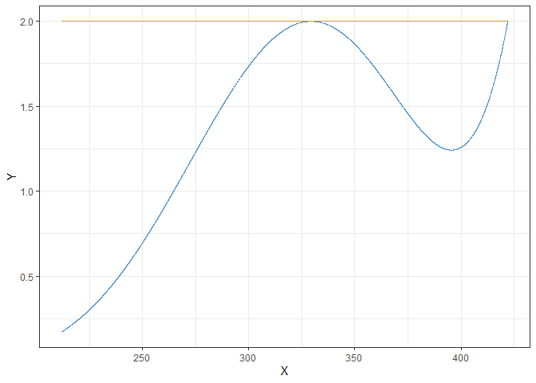
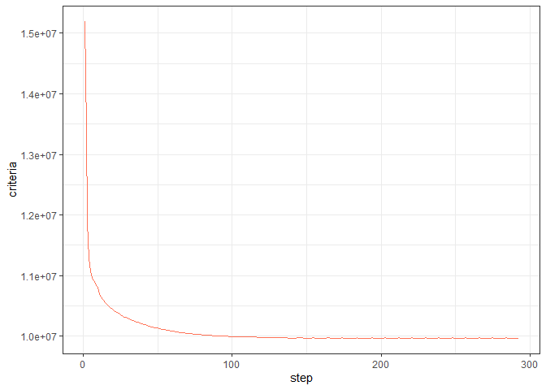
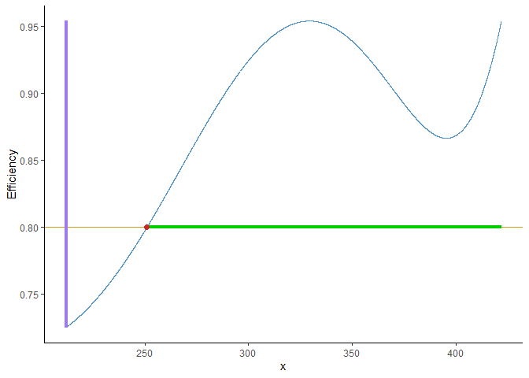

<!-- README.md is generated from README.Rmd. Please edit that file -->

# optedr

<!-- badges: start -->

<!-- use_this::use_cran_badge() -->

<!-- use_this::use_lifecycle_badge(stage) -->

<!-- badges: end -->

## Overview

The package **optedr** is an optimal experimental design suite for
calculating optimal designs, D-augmenting designs and efficiently
rounding approximate design. Among its capabilities are:

  - Calculating D-, Ds-, A- and I-optimal designs for non-linear models.
  - D-augment designs controlling the loss of efficiency.
  - Evaluate the efficiency of a given design against the optimum.
  - Effiently rounding approximate designs to exact designs.

## Installation

<!-- You can install the released version of optedr from [CRAN](https://CRAN.R-project.org) with: -->

<!-- ``` r -->

<!-- install.packages("optedr") -->

<!-- ``` -->

You can install the latest version of the package from
[GitHub](https://github.com/) with:

``` r
devtools::install_github("kezrael/optedr")
```

## Functions

The user available functions are:

  - `opt_des()` calculates optimal designs.
  - `design_efficiency()` evaluates the effiency of a design against the
    optimum.
  - `augment_design()` augments designs, allowing the user to add points
    controlling the D-efficiency.
  - `efficient_round()` effiently round approximate designs.
  - `shiny_optimal()` demo of optimal designs calculation with a
    graphical interface, applied to *Antoine’s Equation*.
  - `shiny_augment()` demo of augmenting design with a graphical
    interface, usable for a handful of models.

The `optdes` object generated by `opt_des()` has its own implementation
of `print()`, `summary()` and `plot()`.

## Usage

``` r
library(optedr)
```

The calculation of an optimal design requires a to specify the
`Criterion`, the `model`, the `parameters` and their initial values and
the `design_space`.

``` r
resArr.D <- opt_des(Criterion = "D-Optimality",
                    model = y ~ a*exp(-b/x),
                    parameters = c("a", "b"),
                    par_values = c(1, 1500),
                    design_space = c(212, 422))
#> i Stop condition not reached, max iterations performed
#> i The lower bound for efficiency is 99.9986396401789%

resArr.D$optdes
#>      Point    Weight
#> 1 329.2966 0.5000068
#> 2 422.0000 0.4999932
resArr.D$sens
```



``` r
resArr.D$convergence
```



After calculating the D-optimal design, the user might want to add
points to the design to fit their needs:

``` r
aug_arr <- augment_design(resArr.D$optdes, 0.3, y ~ a * exp(-b/x),
               parameters = c("a", "b"),
               par_values = c(1, 1500),
               design_space = c(212, 422),
               F)
```



        Choose a value for the minimum relative efficiency between 0.73 and 0.95 : 	
		0.8
	#>	The region(s) are  [250.98-422]
		Choose a point to add or enter another character to finish: 
		260
		Choose the weight of the point: 
		0.15
	#>	The region(s) are  [250.98-422]
		Choose a point to add or enter another character to finish: 
		380
		Choose the weight of the point: 
		0.15
	#>	The region(s) are  [250.98-422]
		Choose a point to add or enter another character to finish: 
		f
    aug_arr
    #>      Point    Weight
    #> 1 329.2966 0.3500048
    #> 2 422.0000 0.3499952
    #> 3 260.0000 0.1500000
    #> 4 380.0000 0.1500000

This new design can be rounded to the desired number of points:

``` r
(exact_design <- efficient_round(aug_arr, 20))
#>      Point Weight
#> 1 329.2966      7
#> 2 422.0000      7
#> 3 260.0000      3
#> 4 380.0000      3
```

And its effiency compared against the optimum:

``` r
aprox_design <- exact_design
aprox_design$Weight <- aprox_design$Weight /sum(aprox_design$Weight)

design_efficiency(resArr.D, aprox_design)
#> i The efficiency of the design is 86.0744365761564%
#> [1] 0.8607444
```
