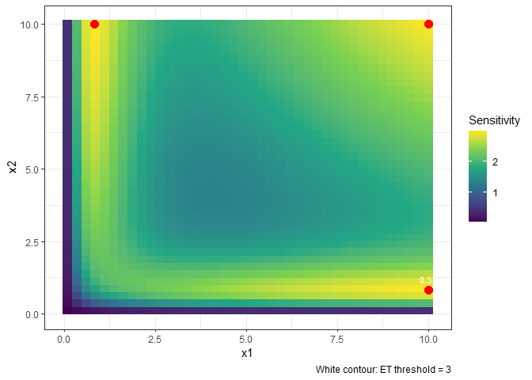
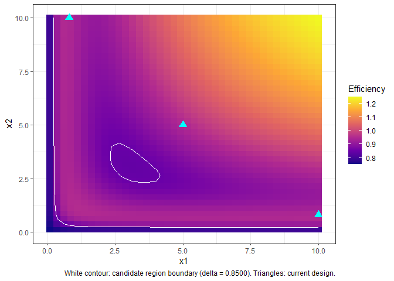
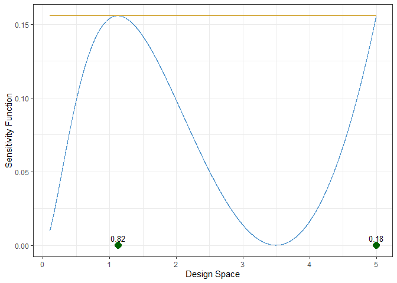

<!-- README.md is generated from README.Rmd. Please edit that file -->

# optedr

<!-- badges: start -->

[](https://CRAN.R-project.org/package=optedr)
[](https://lifecycle.r-lib.org/articles/stages.html#stable)
<!-- badges: end -->

## Overview

**optedr** is an optimal experimental design suite for non-linear and
multi-factor models. Its main capabilities are:

- Calculating **D-, Ds-, A-, I- and L-optimal** designs for non-linear
  models with any number of factors.
- Calculating **Compound** designs combining multiple criteria with
  user-specified weights.
- Calculating **KL-Optimality** designs for model discrimination,
  supporting Normal, Poisson, Binomial and Gamma families.
- **Augmenting** existing designs with controlled D-efficiency loss.
- Evaluating the **efficiency** of a design against the optimum.
- **Rounding** approximate designs to exact designs.

## Installation

You can install the released version of optedr from
[CRAN](https://CRAN.R-project.org) with:

``` r
install.packages("optedr")
```

You can install the latest version from [GitHub](https://github.com/)
with:

``` r
devtools::install_github("kezrael/optedr")
```

## Functions

- `opt_des()` — calculates optimal designs.
- `design_efficiency()` — evaluates the efficiency of a design against
  the optimum.
- `get_augment_region()` — computes the candidate region for
  augmentation with controlled efficiency loss.
- `augment_design()` — adds points to a design and rescales weights.
- `efficient_round()` — rounds approximate designs to exact designs
  (multiplier method).
- `combinatorial_round()` — rounds approximate designs to exact designs
  (exhaustive floor/ceiling search).
- `make_kl_fun()` — constructs a KL divergence function from two
  model-family pairs.
- `shiny_optimal()` / `shiny_augment()` — interactive Shiny demos.

The `optdes` object returned by `opt_des()` has its own `print()`,
`summary()` and `plot()` methods.

## Usage

``` r
library(optedr)
```

    #> ℹ Loading optedr

### Optimal design

`opt_des()` requires a `criterion`, a `model`, `parameters` and their
nominal values, and a `design_space`. For multi-factor models pass
`design_space` as a named list — variable names must match those in
`model`.

``` r
library(optedr)

result_D <- opt_des(
  criterion    = "D-Optimality",
  model        = y ~ Vmax * x1 * x2 / ((K1 + x1) * (K2 + x2)),
  parameters   = c("Vmax", "K1", "K2"),
  par_values   = c(1, 1, 1),
  design_space = list(x1 = c(0.1, 10), x2 = c(0.1, 10))
)
#> 
#> ℹ Stop condition reached: difference between sensitivity and criterion < 1e-05
#> ⠙ Calculating optimal design 22 done (11/s) | 2sℹ The lower bound for efficiency is 99.9990099490678%
#>                                                  
result_D
#> Optimal design for D-Optimality (2 factors):
#>           x1         x2    Weight
#> 1  0.8332604 10.0000000 0.3333301
#> 2 10.0000000  0.8332352 0.3333300
#> 3 10.0000000 10.0000000 0.3333399
```

`plot()` returns a heatmap of the sensitivity function, with support
points overlaid in red. By the Equivalence Theorem the design is optimal
if and only if the sensitivity equals the number of parameters at every
support point and is below it everywhere else.

``` r
plot(result_D)
```



`summary()` gives additional detail: criterion value, Atwood convergence
criterion, and the design space.

### Other criteria

The same interface supports five optimality criteria:

| Criterion         | Key argument | Objective                               |
|-------------------|--------------|-----------------------------------------|
| `"D-Optimality"`  | —            | Minimise $-\log\det M$                  |
| `"Ds-Optimality"` | `par_int`    | Focus on a subset of parameters         |
| `"A-Optimality"`  | —            | Minimise $\operatorname{tr} M^{-1}$     |
| `"I-Optimality"`  | `reg_int`    | Minimise integrated prediction variance |
| `"L-Optimality"`  | `matB`       | Minimise $\operatorname{tr}(B\,M^{-1})$ |

For example, A-Optimality minimises the average variance of all
estimators:

``` r
result_A <- opt_des(
  criterion    = "A-Optimality",
  model        = y ~ Vmax * x1 * x2 / ((K1 + x1) * (K2 + x2)),
  parameters   = c("Vmax", "K1", "K2"),
  par_values   = c(1, 1, 1),
  design_space = list(x1 = c(0.1, 10), x2 = c(0.1, 10))
)
#> 
#> ℹ Stop condition not reached, max iterations performed
#> ⠙ Calculating optimal design 22 done (14/s) | 1.6sℹ The lower bound for efficiency is 99.9999976902864%
#>                                                    
result_A
#> Optimal design for A-Optimality (2 factors):
#>           x1         x2    Weight
#> 1  0.6569581 10.0000000 0.3725354
#> 2 10.0000000  0.6569844 0.3725333
#> 3 10.0000000 10.0000000 0.2549313
```

### Compound criterion

Combine any set of criteria as a weighted sum. Weights are normalised
automatically.

``` r
result_DI <- opt_des(
  criterion    = "Compound",
  model        = y ~ Vmax * x1 * x2 / ((K1 + x1) * (K2 + x2)),
  parameters   = c("Vmax", "K1", "K2"),
  par_values   = c(1, 1, 1),
  design_space = list(x1 = c(0.1, 10), x2 = c(0.1, 10)),
  compound     = list(
    list(criterion = "D-Optimality", weight = 0.6),
    list(criterion = "I-Optimality", weight = 0.4,
         reg_int = list(x1 = c(1, 5), x2 = c(1, 5)))
  )
)
#> ⠙ Calculating optimal design 7 done (3.3/s) | 2.1s⠹ Calculating optimal design 8 done (3.2/s) | 2.5s⠸ Calculating optimal design 9 done (3.1/s) | 2.9s⠼ Calculating optimal design 10 done (3/s) | 3.3s ⠴ Calculating optimal design 11 done (3.1/s) | 3.5s⠦ Calculating optimal design 13 done (3.4/s) | 3.8s⠧ Calculating optimal design 14 done (3.4/s) | 4.1s⠇ Calculating optimal design 16 done (3.6/s) | 4.4s⠏ Calculating optimal design 17 done (3.7/s) | 4.6s⠋ Calculating optimal design 18 done (3.8/s) | 4.8s⠙ Calculating optimal design 20 done (3.9/s) | 5.1s⠹ Calculating optimal design 21 done (4/s) | 5.3s  
#> ℹ Stop condition not reached, max iterations performed
#> ⠸ Calculating optimal design 22 done (4/s) | 5.5sℹ The lower bound for efficiency is 98.0491819762597%
#>                                                   
result_DI
#> Optimal design for Compound (0.60*D + 0.40*I):
#>           x1        x2    Weight
#> 1  0.9122428  8.703202 0.3548138
#> 2  1.6738998  1.439094 0.1073170
#> 3 10.0000000  1.012563 0.3389087
#> 4 10.0000000 10.000000 0.1989605
```

### Design efficiency

`design_efficiency()` measures the fraction of the optimal information
that a given design achieves. An efficiency of 0.80 means the design
needs $1/0.80 = 1.25\times$ more observations to match the optimal.

``` r
corners <- data.frame(
  x1     = c(0.1, 10,  0.1, 10),
  x2     = c(0.1, 0.1, 10,  10),
  Weight = rep(0.25, 4)
)
eff <- design_efficiency(corners, result_D)
#> ℹ The efficiency of the design is 19.3350596170462%
```

### Augmenting designs

`get_augment_region()` finds which points can be added to an existing
design while keeping its D-efficiency above a threshold `delta_val`.
`augment_design()` then adds the chosen point and rescales weights. Both
functions work in 1D and multi-dimensional spaces.

``` r
init_des <- data.frame(
  x1     = c(0.8, 10,  5),
  x2     = c(10,  0.8, 5),
  Weight = c(1/3, 1/3, 1/3)
)

region <- get_augment_region(
  criterion           = "D-Optimality",
  init_design         = init_des,
  alpha               = 0.25,
  model               = y ~ Vmax * x1 * x2 / ((K1 + x1) * (K2 + x2)),
  parameters          = c("Vmax", "K1", "K2"),
  par_values          = c(1, 1, 1),
  design_space        = list(x1 = c(0.1, 10), x2 = c(0.1, 10)),
  calc_optimal_design = FALSE,
  delta_val           = 0.85
)
```



`region$region` contains the candidate points ranked by efficiency gain.
Pick the best and augment:

``` r
best <- region$region[which.max(region$region$efficiency), ]

augmented <- augment_design(
  criterion           = "D-Optimality",
  init_design         = init_des,
  alpha               = 0.25,
  model               = y ~ Vmax * x1 * x2 / ((K1 + x1) * (K2 + x2)),
  parameters          = c("Vmax", "K1", "K2"),
  par_values          = c(1, 1, 1),
  design_space        = list(x1 = c(0.1, 10), x2 = c(0.1, 10)),
  calc_optimal_design = FALSE,
  delta_val           = 0.85,
  new_points          = data.frame(x1 = best$x1, x2 = best$x2, Weight = 1)
)
```


    #> ℹ 1903 candidate points with efficiency >= 0.85 (from LHS sample of 2000)
    #> Sample of candidate points:
    #>           x1        x2 efficiency
    #> 1  6.7385595 0.2924680  0.8909334
    #> 2  1.9821626 1.1154958  0.9394470
    #> 3  4.0971554 8.4766962  1.0007669
    #> 4  6.0239305 8.7571051  1.1028042
    #> 5  4.6024281 0.4528793  0.9276096
    #> 6  9.4770793 4.5600493  1.0465406
    #> 7  0.9444112 2.8258679  0.9368173
    #> 8  8.0232267 1.8904368  0.8922271
    #> 9  3.1618572 4.4661287  0.8625847
    #> 10 5.0458372 9.1524421  1.0662419
    #> 11 7.0391033 7.7941107  1.1160897
    #> 12 0.4494250 7.4074376  0.9311998
    #> 13 1.5010313 3.8698458  0.8872015
    #> 14 8.1851605 4.7172844  1.0284918
    #> 15 3.2994805 9.4786392  0.9698640
    augmented
    #>          x1        x2 Weight
    #> 1  0.800000 10.000000   0.25
    #> 2 10.000000  0.800000   0.25
    #> 3  5.000000  5.000000   0.25
    #> 4  9.912547  9.954952   0.25

### Rounding to exact designs

Approximate designs assign continuous weights. Two functions convert
them to integer replication counts for a given total $n$:

``` r
# Multiplier method
efficient_round(result_D$optdes, n = 12)
#>           x1         x2 Weight
#> 1  0.8332604 10.0000000      4
#> 2 10.0000000  0.8332352      4
#> 3 10.0000000 10.0000000      4

# Exhaustive floor/ceiling search (optimal for small number of support points)
combinatorial_round(result_D, n = 12)
#>           x1         x2 Weight
#> 1  0.8332604 10.0000000      4
#> 2 10.0000000  0.8332352      4
#> 3 10.0000000 10.0000000      4
```

### KL-Optimality

KL-Optimality finds the design that maximises the Kullback-Leibler
divergence between a reference model and the most adversarial rival, for
Normal, Poisson, Binomial and Gamma families.

``` r
result_kl <- opt_des(
  "KL-Optimality",
  model        = y ~ Vmax * x / (Km + x),
  parameters   = c("Vmax", "Km"),
  par_values   = c(2, 1),
  design_space = c(0.1, 5),
  rival_model  = y ~ a * x,
  rival_params = c("a"),
  rival_pars   = c(1),
  rival_lower  = c(0.2),
  rival_upper  = c(2.5),
  family       = "Normal",
  phi          = 1
)
#> 
#> ℹ Stop condition reached: difference between sensitivity and criterion < 1e-05
#> ⠙ Calculating optimal design 7 done (8.1/s) | 863msℹ The lower bound for efficiency is 99.9957589718079%
#>                                                     
result_kl
#> Optimal design for KL-Optimality:
#>      Point    Weight
#> 1 1.127578 0.8159831
#> 2 5.000000 0.1840169
plot(result_kl)
```



`make_kl_fun()` automates the KL function construction for custom
model-family pairs, including different error structures or families.

## Learn more

- `vignette("optedr-intro")` — optimality criteria, multi-dimensional
  design spaces, compound designs, efficiency and rounding.
- `vignette("optedr-augment")` — augmenting designs in 1D, 2D and 3D
  with controlled efficiency loss.
- `vignette("optedr-kl")` — KL-Optimality for model discrimination,
  `make_kl_fun()`, and the Hill model case study.
